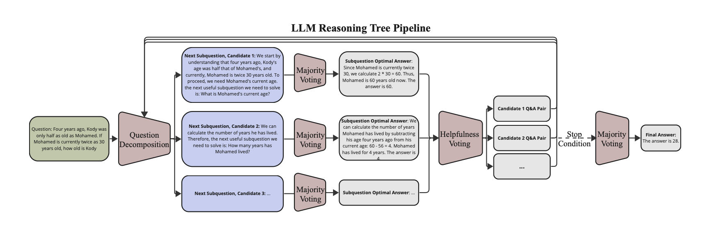
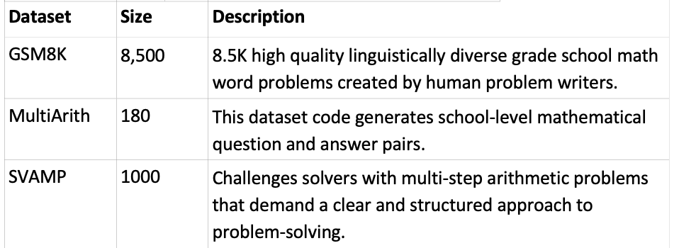
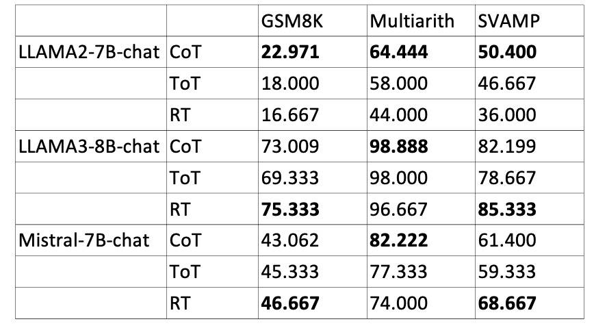

# Reasoning Tree
## Abstract 
Large Language Models (LLMs) excel in complex reasoning tasks with specialized prompting but often struggle with mathematical content. 
Methods like training on vast datasets demand extensive computational resources, while innovative prompting techniques mainly benefit larger models like GPT-4. 
Our goal is to improve smaller LLMs’ math problem-solving skills under resource constraints. 
We identify key components needed for math problem-solving: problem decomposition, modeling, and calculations. 
Smaller LLMs are adept at decomposition but falter in modeling and calculations. 
We propose Reasoning Tree: Strategic Reasoning for Problem-Solving with LLM, expanding on Tree-of-Thought[[1]](#1), which integrates problem decomposition, 
evaluation, and voting to enhance smaller LLMs' reasoning ability without extra training. 

## Method
### Step 1: Question Decomposition
A math question can be decomposed into a sequence of subquestions. When answered sequentially, they lead to better mathematical reasoning ability.
We generate multiple candidates for the next subquestion using a question decomposition prompt and use majority voting to get the best answer for each subquestion.

### Step 2: Helpfulness Voting & Beam Tree Search
We use a helpfulness voting prompt to determine the best K subquestion among Step 1’s Subquestions. 
We confine the search space to the top K voted Q&A pair and recurse to expand the tree search.

### Step 3: Stop Condition & Final Majority Vote
We regard subanswers as valid candidates for the final answer if LLM starts to answer the original question 
We apply majority voting again to the last question to find the optimal, global final answer.

## Result
### Dataset

### Metrics

## Reference
<a id="1">[1]</a> 
Yao, Shunyu, et al. "Tree of thoughts: Deliberate problem solving with large language models." Advances in Neural Information Processing Systems 36 (2024).
